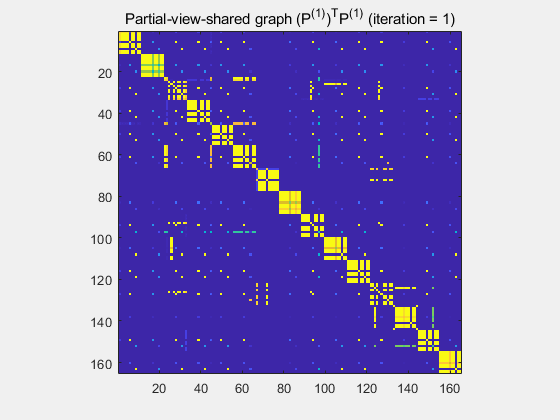
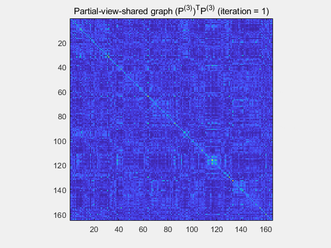

# CDPMVL: Consensus and Diversity-fusion Partial-view-shared Multi-view Learning

## Introduction

CDPMVL is an algorithm that partitions data into three parts: (a) consensual part; (b) partial-view-shared part; and (c) specific part. It learns consensus and partial-view-shared knowledge for clustering. Some visualisation results on YALE are as follows (please refer to ```./visualization/``` for more).

 |  |  |  |
| ------------------------- | ------------------------- | ------------------------- |
 |  |  |  |
 

## Example usage

- Use ```addpath('./utils/');``` and ```addpath(genpath('./utils/'))``` to add the required auxiliary functions, after which you can use ``` CDPMVL(fea, gt, options)```to call CDPMVL wherever you need to.

- You can launch the program by executing "demo_YALE.m" in the root directory (in windows) on ```Matlab```

```python
demo_YALE.m
```

- or use the following command to run it in Linux (The output will be stored in "fill.out"). The codes will be run directly without errors.

```Cpython
nohup matlab <demo_YALE.m> fill.out &
```

## Files

├─ **demo_YALE.m**: A demo that runs CDPMVL on YALE.  
├─ CDPMVL: A series of functions that implement CDPMVL  
├─ utils: A series of auxiliary functions.   
└─visualization: Some experimental results of visualization performed on CDPMVL.  